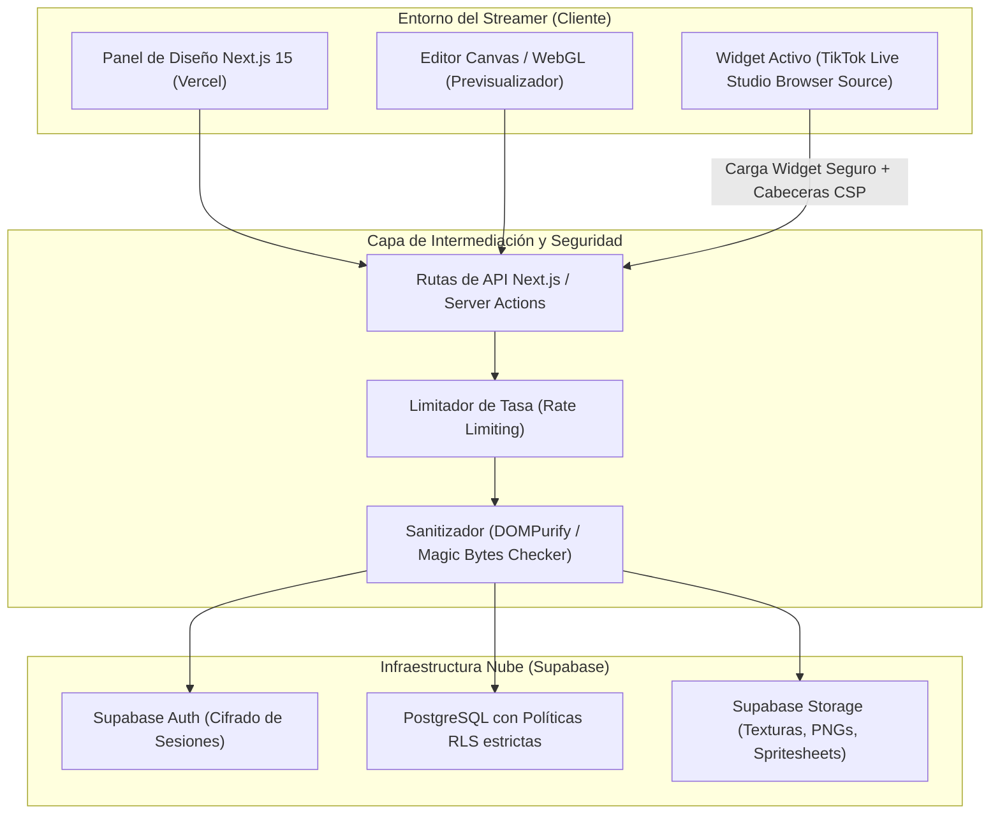

# 🌐 INFORME GLOBAL DE ESTRUCTURA Y ARQUITECTURA: WINSNIPE

Este informe técnico consolidado define la arquitectura del sistema, el flujo de datos, el stack tecnológico y el plan de seguridad definitivo para **WinSnipe** (TokBattle Studio), optimizado para streamers en la plataforma **TikTok Live**.

---

## 1. VISIÓN GENERAL DE LA PLATAFORMA

**WinSnipe** es una plataforma de software como servicio (SaaS) orientada al diseño de recursos visuales interactivos y efectos de realidad aumentada de alto impacto para transmisiones en directo en TikTok.

El sistema opera bajo dos vertientes de autoría independientes:
1.  **Overlays de Pantalla (2D):** Indicadores competitivos, cuentas regresivas y mecánicas visuales de "TAP TAP" y multiplicadores de "Guante", optimizados como widgets web de bajísimo consumo de CPU.
2.  **AR Asset Factory (Realidad Aumentada):** Un estudio de diseño en el navegador para compilar texturas y sistemas de partículas configurados bajo estándares de seguimiento corporal (ej. seguimiento de manos para guantes de boxeo), listos para exportar directamente hacia **TikTok Effect House**.

### 1.5. ESTRATEGIA DE SALIDA DE RECURSOS (VIDEOS VS. AR ASSETS)

Para garantizar la máxima fidelidad visual y competir directamente con los efectos oficiales de la plataforma (como las animaciones del León o Dragón en 3D), WinSnipe implementará una **estrategia de salida dual** y optimizada:

#### A. Overlays para TikTok Live Studio (Widgets Activos y Videos)
*   **WebM con Canal Alfa (Transparencia Real):** Salida por defecto y recomendada de la plataforma. La animación se exporta a 60 FPS en resolución 1080x1920 con un canal de transparencia nativo real para que el streamer la inyecte directamente en TikTok Live Studio como "Fuente Multimedia" sin halos ni bordes verdes pixelados.
*   **MP4 con Pantalla Verde (Chroma Key):** Formato alternativo (fallback) con fondo croma verde sólido (#00B140). Ideal para creadores que editan clips de batallas desde el móvil (CapCut) o para herramientas de transmisión antiguas.

#### B. AR Asset Factory (Para Creadores en TikTok Effect House)
*   **Compilador de Spritesheets y JSON:** El usuario diseña el guante y los efectos de partículas neón. La plataforma empaqueta automáticamente las imágenes secuenciales animadas en un archivo comprimido `.zip` con un manifiesto `.json` listo para importarse directamente a **TikTok Effect House** (dentro de las plantillas de Hand Tracking o Screen Effects).

---

## 2. ARQUITECTURA DE SISTEMA (DIAGRAMA)



---

## 3. STACK TECNOLÓGICO CONSOLIDADO

| Capa | Tecnología | Propósito |
| :--- | :--- | :--- |
| **Frontend UI** | Next.js 15 (App Router), Tailwind CSS, Framer Motion | Renderizado e interactividad fluida del Dashboard y catálogo. |
| **Lienzo 2D** | HTML5 Canvas, Web Animations API | Overlays ligeros con renderizado óptimo y exportación a WebM. |
| **Lienzo 3D (AR)** | Three.js (WebGL) | Simulación interactiva de guantes y partículas sobre un maniquí de seguimiento. |
| **Autenticación** | Supabase Auth | Registro e inicio de sesión cifrado. |
| **Base de Datos** | PostgreSQL (Supabase) | Almacenamiento relacional de perfiles y esquemas JSON de plantillas. |
| **Almacenamiento** | Supabase Storage | Alojamiento de imágenes PNG, spritesheets y archivos de texturas. |

---

## 4. MODELO DE DATOS NÚCLEO (JSON SCHEMA)

Cada efecto neón o recurso AR creado por los streamers se procesa y exporta en la base de datos bajo este esquema estructurado:

```json
{
  "id_efecto": "string (UUID v4)",
  "id_usuario": "string (UUID v4)",
  "nombre": "string (ej. Guante de Boxeo de Fuego)",
  "tipo_efecto": "tap_tap | mvp_alert | tiktok_ar_asset",
  "configuracion_visual": {
    "asset_url": "string (URL segura en Supabase Storage)",
    "escala_inicial": "float (ej. 0.6)",
    "escala_maxima": "float (ej. 1.4)",
    "comportamiento_particulas": {
      "tipo_textura": "string (nombre del archivo en storage)",
      "velocidad_ascenso": "int (píxeles por segundo)",
      "dispersion_lateral": "int (rango de chispas)",
      "opacidad_final": "float (0.0 a 1.0)"
    }
  },
  "linea_tiempo_ar": {
    "frame_start": "int (fotograma de inicio)",
    "frame_end": "int (fotograma final)",
    "fps_objetivo": "int (30 o 60)",
    "tipo_tracking": "hand_tracker | face_tracker | none",
    "curva_velocidad": "string (ease-out | linear | cubic-bezier)"
  }
}
```

---

## 5. MARCO DE SEGURIDAD DEFENSIVA

Para garantizar la estabilidad y la integridad de la PC de transmisión de los streamers al cargar widgets en **TikTok Live Studio**, el sistema implementa cuatro capas de seguridad:

1.  **Escudo Anti-XSS (TikTok Live Studio Browser Source):**
    *   Todo texto personalizado se procesa con **DOMPurify** en la API del servidor.
    *   El motor de renderizado 2D dibuja los elementos directamente en el Canvas mediante instrucciones de trazado nativas (`fillText`), bloqueando el uso de `innerHTML` o `dangerouslySetInnerHTML`.
    *   Los endpoints de widgets cargan con cabeceras estrictas de **Content Security Policy (CSP)** para neutralizar scripts externos maliciosos.
2.  **Seguridad en Carga de Archivos (Upload Hardening):**
    *   Validación estricta de **Magic Bytes** en el backend para verificar que los archivos binarios subidos correspondan realmente a formatos de imágenes válidos (`image/png`), bloqueando scripts encubiertos.
    *   Límite físico máximo de **5 MB** por archivo.
3.  **Seguridad a Nivel de Base de Datos (Row Level Security):**
    *   Políticas RLS en PostgreSQL para asegurar aislamiento total; ningún usuario puede leer o alterar plantillas ajenas.
4.  **Rate Limiting (Protección de Recursos):**
    *   Limitación de tasa en las rutas de la API de Next.js para repeler ataques automatizados y saturación de recursos.

---

## 🚀 6. HOJA DE RUTA DE IMPLEMENTACIÓN

*   **Fase 1: Cimientos y Overlays Interactivos (Completado y Sincronizado)**
    *   Configuración del repositorio Git y despliegue inicial.
    *   Simulador dinámico 2D en tiempo real (clonado en la rama `main` en GitHub).
*   **Fase 2: Editor Visual Avanzado y AR Asset Factory 2D**
    *   Controles deslizantes de línea de tiempo (`Frame Start`/`Frame End`) y tipo de seguimiento.
    *   Cargador con validación de Magic Bytes para imágenes personalizadas.
*   **Fase 3: Previsualizador WebGL 3D (Three.js)**
    *   Integración del lienzo interactivo 3D para simulación física de guantes AR sobre un maniquí de seguimiento.
*   **Fase 4: Optimización, Pruebas de Carga y Lanzamiento Beta**
    *   Pruebas de recolección de basura del Canvas para evitar fugas de memoria en transmisiones prolongadas.
    *   Despliegue e integración oficial.
